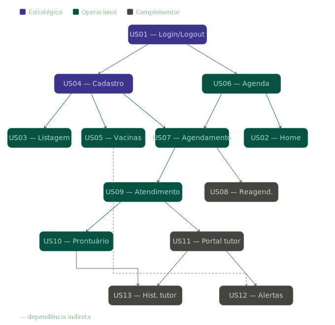

# Planejamento e Priorização do Backlog

## Metodologia de Escolha: ICE Scoring
O grupo optou pelo método de priorizaçao **ICE (Impact, Confidence, Ease)** para estabelecer uma hierarquia objetiva de desenvolvimento. Esta metodologia permite equilibrar o valor entregue ao negócio com a viabilidade técnica, garantindo que o esforço da equipe seja alocado nos itens de maior retorno para o negócio.

A pontuação é calculada pela fórmula:
$$Score = Impacto \times Confiança \times Facilidade$$

### Definição dos Critérios 
* **Impacto:** Mensura o quanto a funcionalidade é vital para o funcionamento da clínica.
    * **10:** Essencial para a existência da operação (sem ela, o sistema é inutilizável).
    * **1:** Melhoria mínima e que não afeta o fluxo principal de trabalho.
* **Confiança:** Define o grau de clareza dos requisitos e a certeza técnica da implementação.
    * **10:** Requisitos detalhados, sem incertezas técnicas ou de negócio.
    * **1:** Ideia abstrata com alto risco de mudança ou necessidade de muita pesquisa.
* **Facilidade:** Avalia a simplicidade de desenvolvimento e o tempo de entrega.
    * **10:** Tarefa simples, de implementação rápida e baixo esforço.
    * **1:** Alta complexidade técnica, exigindo longo tempo de desenvolvimento e muitos recursos.

### Matriz de Prioridade
Para a organização das sprints, as histórias foram classificadas conforme os seguintes intervalos de score:

| Faixa de Score | Classificação | Descrição Estratégica |
| :--- | :--- | :--- |
| **500 a 1000** | **Estratégico** | Alta prioridade. Itens indispensáveis para o lançamento do MVP. |
| **200 a 499** | **Operacional** | Prioridade média. Itens necessários ao MVP, mas não prioritários.|
| **1 a 199** | **Complementar** | Baixa prioridade. Itens que podem complementar o MVP.|

Os intervalos de classificação (Estratégico, Operacional e Complementar) foram definidos pela equipe com base no score máximo possível (10 × 10 × 10 = 1000), distribuído em três faixas proporcionais.

---

## Tabela de Priorização com Pesos (ICE)

| ID | História de Usuário | Impacto | Confiança | Facilidade | **Score Final** | **Classificação** | Depende de |
| :--- | :--- | :---: | :---: | :---: | :---: | :--- | :--- |
| **US01** | Acesso ao Sistema (Login/Logout) | 10 | 10 | 9 | **900** | Estratégico | — |
| **US04** | Cadastro de Paciente e Tutor | 10 | 10 | 7 | **700** | Estratégico | US01 |
| **US09** | Registro de Atendimento Clínico | 10 | 9 | 5 | **450** | Operacional | US04, US07 |
| **US07** | Criação de Novo Agendamento | 9 | 9 | 5 | **405** | Operacional | US04, US06 |
| **US03** | Listagem e Busca de Pacientes | 7 | 10 | 5 | **350** | Operacional | US04 |
| **US06** | Visualização da Agenda Diária | 8 | 8 | 5 | **320** | Operacional | US01 |
| **US10** | Consulta ao Histórico e Prontuário | 7 | 9 | 4 | **252** | Operacional | US09 |
| **US05** | Histórico de Vacinação | 7 | 8 | 4 | **224** | Operacional | US04 |
| **US02** | Painel Inicial (Home) | 7 | 7 | 5 | **245** | Operacional | US01, US06 |
| **US08** | Cancelamento e Reagendamento | 6 | 8 | 2 | **96** | Complementar | US07 |
| **US11** | Dashboard do Tutor | 5 | 6 | 5 | **150** | Complementar | US04, US09 |
| **US13** | Histórico Completo Visão Tutor | 4 | 6 | 4 | **96** | Complementar | US11, US10 |
| **US12** | Alertas e Recomendações (Care) | 4 | 5 | 3 | **60** | Complementar | US11, US05 |

---

## Grafo de Dependências entre Histórias

---

## Planejamento dos MVPs

### Visão Geral

O desenvolvimento foi distribuído em **3 MVPs incrementais** ao longo de **12 semanas**, organizados em ciclos de aproximadamente 4 semanas cada. Cada MVP entrega um conjunto funcional e testável, permitindo validação incremental antes de avançar para o próximo ciclo.

---

### MVP 1 — Base Operacional da Clínica
**Período:** Semanas 1 a 4  
**Objetivo:** Entregar o núcleo do sistema — acesso seguro, cadastro de pacientes e controle de agenda. Ao final deste ciclo, a clínica já consegue autenticar usuários, cadastrar animais e tutores, e visualizar e criar agendamentos.

| ID | História de Usuário | Classificação | Prioridade no ciclo |
| :--- | :--- | :--- | :--- |
| **US01** | Acesso ao Sistema (Login/Logout) | Estratégico | 1ª — base de tudo |
| **US04** | Cadastro de Paciente e Tutor | Estratégico | 2ª — depende de US01 |
| **US06** | Visualização da Agenda Diária | Operacional | 3ª — depende de US01 |
| **US03** | Listagem e Busca de Pacientes | Operacional | 4ª — depende de US04 |
| **US07** | Criação de Novo Agendamento | Operacional | 5ª — depende de US04 e US06 |

**Resultado esperado**: *Ao fim deste ciclo, é possível autenticar, cadastrar um paciente com seu tutor, visualizar a agenda do dia e registrar um novo agendamento.*

---

### MVP 2 — Atendimento Clínico e Histórico
**Período:** Semanas 5 a 8  
**Objetivo:** Adicionar o módulo de prontuário e atendimento clínico, além do histórico de vacinação e o painel inicial. Ao final deste ciclo, o sistema já suporta o fluxo completo de uma consulta — do agendamento ao registro clínico.

| ID | História de Usuário | Classificação | Prioridade no ciclo |
| :--- | :--- | :--- | :--- |
| **US09** | Registro de Atendimento Clínico | Operacional | 1ª — depende de US04 e US07 |
| **US05** | Histórico de Vacinação | Operacional | 2ª — depende de US04 |
| **US10** | Consulta ao Histórico e Prontuário | Operacional | 3ª — depende de US09 |
| **US02** | Painel Inicial (Home) | Operacional | 4ª — depende de US01 e US06 |

**Resultado esperado**: *Ao fim deste ciclo, é possível registrar um atendimento clínico completo, consultar o prontuário e o histórico de vacinação, e visualizar o painel inicial com a agenda e os últimos atendimentos.*

---

### MVP 3 — Portal do Tutor e Funcionalidades Complementares
**Período:** Semanas 9 a 12  
**Objetivo:** Entregar o portal do tutor e as funcionalidades complementares restantes. A última semana deste ciclo é dedicada a testes de integração, correção de bugs e preparação para a entrega final do projeto.

| ID | História de Usuário | Classificação | Prioridade no ciclo |
| :--- | :--- | :--- | :--- |
| **US11** | Dashboard do Tutor | Complementar | 1ª — depende de US04 e US09 |
| **US08** | Cancelamento e Reagendamento | Complementar | 2ª — depende de US07 |
| **US13** | Histórico Completo Visão Tutor | Complementar | 3ª — depende de US11 e US10 |
| **US12** | Alertas e Recomendações (Care) | Complementar | 4ª — depende de US11 e US05 |

**Resultado esperado**: *Ao fim deste ciclo, o tutor consegue acessar seu dashboard, visualizar o histórico do seu pet e receber alertas sobre vacinas e consultas. A clínica consegue cancelar ou reagendar atendimentos existentes.*

---

## Referências

* **ICE Scoring Model | Definition and Overview** — ProductPlan. Disponível em: [https://www.productplan.com/glossary/ice-scoring-model/](https://www.productplan.com/glossary/ice-scoring-model/). Acesso em: 27 mar. 2026.

* **What is the ICE Scoring Framework? Guide and Template** — Savio. Disponível em: [https://www.savio.io/product-roadmap/ice-scoring-model/](https://www.savio.io/product-roadmap/ice-scoring-model/). Acesso em: 27 mar. 2026.

* **Build your MVP efficiently with agile methodology** — Imaginary Cloud. Disponível em: [https://www.imaginarycloud.com/blog/build-mvp-with-agile](https://www.imaginarycloud.com/blog/build-mvp-with-agile). Acesso em: 27 mar. 2026.

---

## Histórico de Versões

| Versão | Data       | Descrição                                      | Autor     | Revisor            |
|--------|------------|------------------------------------------------|-----------|--------------------|
| 1.0    | 27/03/2026 | Criação do documento                           | [Taynara Vitorino](https://github.com/taybalau)    | |

---